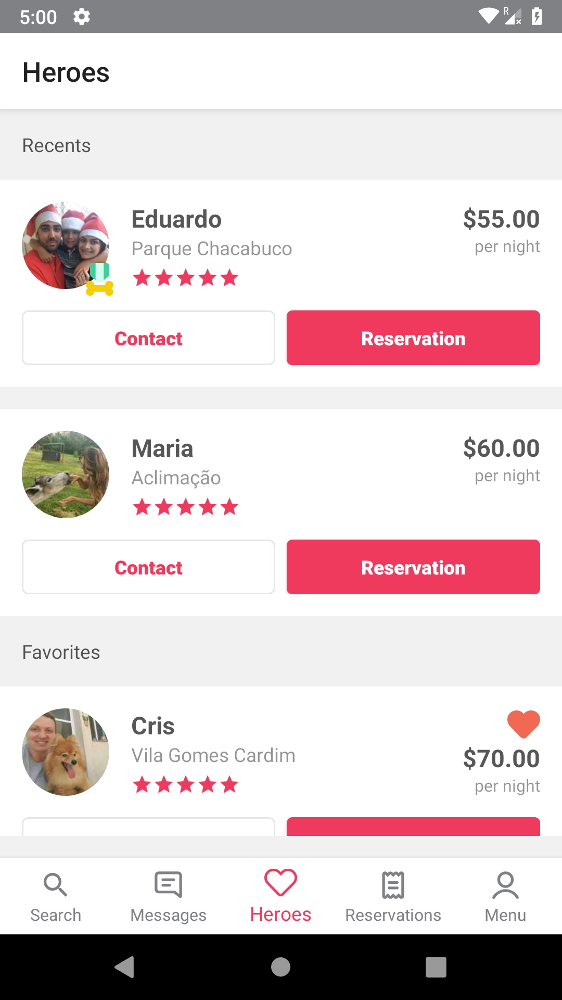

Supported language:  

# Summary
1. [Introduction](#introduction)
   * [Overview](#overview)
   * [Requirements](#requirements)
   * [Showcase](#showcase)
2. [Architecture](#architecture)
   * [Clean Architecture](#clean-architecture)
   * [Design Patterns](#design-patterns)
   * [Quality Assurance](#tests)
   * [Frameworks](#frameworks)
3. [Application Setup](#setup)
4. [License](#license)

<a name="introduction" />

# Introduction

<a name="overview" />

## Overview
My heroes list

 The requirements raised for this assignment shall test concepts of:
 1. Architectural design for Android Applications;
 2. Ability to communicate with complex end-points, parsing JSON responses and update UI;
 4. Use Apiary to communicate with api, to check documentation click in [**link**](https://doghero1.docs.apiary.io/#)

<a name="requirements" />

<table>
  <tr>
    <td colspan="4" align="center"><b>Requirements</b></td>
  </tr>
  <tr>
  <td align="center"><b>ID</b></td>
  <td align="center"><b>Name</b></td>
  <td align="center"><b>Description</b></td>
  </tr>
  <tr>
    <td>REQ001</td>
    <td align="justify">Get my heroes</td>
    <td align="justify">Application must be able to read an URL and parse url</td>
  </tr>
  <tr>
    <td>REQ002</td>
    <td align="justify">Display list heroes</td>
    <td align="justify">Display list when click in item on bottom navigation view</td>
  </tr>
  <tr>
    <td>REQ003</td>
    <td align="justify">Display empty heroes</td>
    <td align="justify">When not has heroes show empty view</td>
  </tr>
  <tr>
    <td>REQ004</td>
    <td align="justify">Display error screen</td>
    <td align="justify">When something is wrong on request show error view</td>
  </tr>
</table>

<a name="showcase" />

## Showcase

  
  
  
  
    
  

